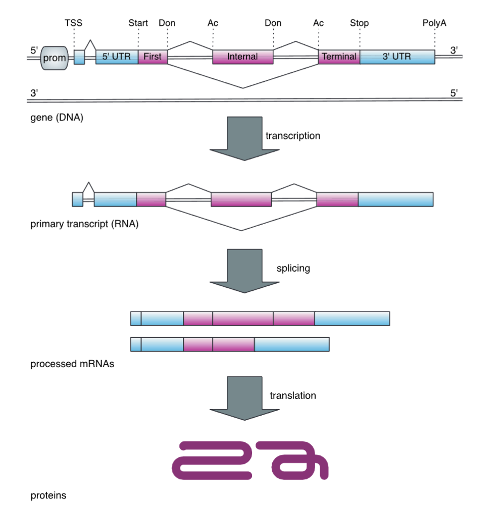

# Eukaryotic Gene Structure

**Summary**: An overview of the structural components of eukaryotic protein-coding genes, from promoter to poly-A signal, including the exon-intron organization that makes eukaryotic gene prediction fundamentally harder than prokaryotic gene finding.

**Sources**: [[2.1.gene_prediction_v15.pdf]] · [[Modelli Nascosti di Markov-Gene pred.pdf]]

**Last updated**: 2026-04-24

---

## The central challenge

In prokaryotes, genes are largely uninterrupted open reading frames (ORFs). Identifying them reduces to finding long ORFs, often guided by Shine-Dalgarno sequences and codon bias. Accuracy upwards of 90% is achievable.

Eukaryotes are fundamentally different:
- Only ~3% of the human genome codes for protein.
- Protein-coding genes are split into **exons** (coding segments) and **introns** (non-coding intervening sequences).
- Introns are spliced out of the primary transcript by the **spliceosome** to produce mature mRNA.
- Introns can exceed 100 kb, making exon detection like "finding a needle in a haystack."
- **Alternative splicing** allows one gene to produce multiple mature transcripts.
- Genes can be interleaved, overlapping, or nested on either strand.

## Anatomy of a eukaryotic gene

```
5'--[Promoter]--[TSS]--[5'UTR]--[Exon1]--[Intron]--[Exon2]--..--[3'UTR]--[PolyA]--3'
                                    ^Don                ^Ac
```



*Figure: Schematic of a eukaryotic gene from promoter to poly-A signal. The diagram shows the alternating exon–intron organisation, the positions of the donor (Don, 5' splice site, canonical GT) and acceptor (Ac, 3' splice site, canonical AG) dinucleotides, and the key regulatory elements (TSS, UTRs, poly-A signal) flanking the coding sequence. Each intron is removed by the spliceosome to produce mature mRNA. (Source: [[raw/graphics/eukaryotic-gene-structure.png]])*

| Component | Description |
|-----------|-------------|
| Promoter | Regulatory region upstream of the gene; recruits RNA Pol II |
| TSS | Transcription Start Site |
| 5' UTR | Untranslated region at the 5' end of the mRNA |
| Exon | Coding segment retained in mature mRNA |
| Intron | Non-coding segment spliced out of primary transcript |
| Donor site (Don) | 5' splice site at the exon-intron boundary (canonical: GT) |
| Acceptor site (Ac) | 3' splice site at the intron-exon boundary (canonical: AG) |
| Branch point | Intronic A residue ~20-50 nt upstream of acceptor; involved in lariat formation |
| Stop codon | First in-frame stop codon in the CDS |
| 3' UTR | Untranslated region at the 3' end |
| Poly-A signal | AATAAA hexamer directing cleavage and polyadenylation |

## Types of exons

- **First exon**: from TSS to first donor site; contains 5' UTR and start of CDS.
- **Internal exon**: flanked by acceptor on 5' side and donor on 3' side.
- **Terminal exon**: from last acceptor to stop codon and into 3' UTR.
- **Single-exon gene**: intronless gene; rare in higher eukaryotes.

## Intron phases and relevance in gene prediction

[[Intron phase]]
[[Relevance of matching intron phases]]

## The spliceosome

The major spliceosome (U2-type) processes the vast majority of introns. It recognises:
1. The **donor site** (GT-AG rule; GU in RNA)
2. The **branch point** adenosine (~20-50 nt from acceptor)
3. The **polypyrimidine tract** between branch point and acceptor
4. The **acceptor site** (AG)

A minor spliceosome (U12-type) handles AT-AC introns (< 1% of human introns).

## Operational definition used in gene prediction

Because of alternative splicing and non-coding transcription, a clean biological definition of "gene" is elusive. Gene finders typically use the operational definition: **one protein-coding sequence per non-overlapping genomic locus** — finding the coordinates and exonic structure of the best-supported model.

## Related pages

- [[gene-prediction]]
- [[signal-sensors]]
- [[content-sensors]]
- [[hidden-markov-models]]
- [[sequence-alignment]]

## Other sources

- Lodish et al. *Molecular Cell Biology* — Chapter on RNA processing
- UCSC Genome Browser gene tracks for visual reference

## Test yourself

**Q**: What is the GT-AG rule?
**A**: The canonical dinucleotides at the 5' (donor) and 3' (acceptor) ends of most eukaryotic introns are GT and AG respectively (GU and AG in RNA). This constraint is used by all gene finders to filter splice site candidates.

**Q**: Why can't you just find long ORFs in eukaryotic genomes the way you can in prokaryotes?
**A**: Because eukaryotic exons are short (average ~170 bp) interrupted by long introns (can be >100 kb). A long ORF in genomic sequence is mostly intron, not coding sequence.

**Q**: What is intron phase and why does it matter for gene prediction?
**A**: Intron phase (0, 1, or 2) describes where within a codon an intron falls. Adjacent exons must have compatible phases to maintain the reading frame. HMM-based gene finders model this explicitly with separate states for each phase.
